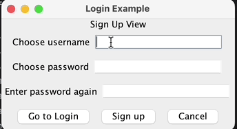
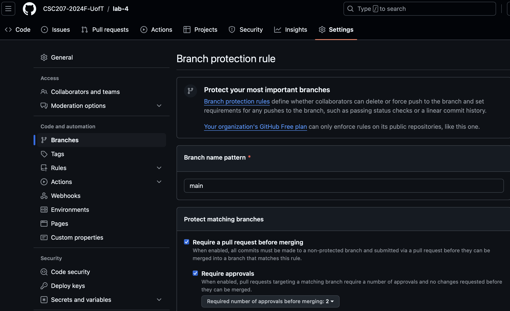

# Clean Architecture Team Lab Activity: Login and Logout

In this team lab activity, your team will:
- explore an existing use case (login)
- add a new use case (logout).

To earn credit:
- your team must demo your working `logout` use case.

Your demo should be similar to the below example:

---

## Task 0: Fork this repo on GitHub
**To get started, one team member should fork this repo on GitHub and share it with the team.
All team members should then clone it.**

**Suggested logistics:** One of you should invite the others to collaborate on their fork of the
original repo on GitHub. You can do this in your repo on GitHub under `Settings -> Collaborators`.
This will allow you to push branches to a common repo and then use pull requests to contribute
your code and review. To prevent others from pushing directly to the main branch,
we recommend you set branch protection rules on GitHub. Below are how the settings might look if you
add branch protection rules:

---

Open the project in IntelliJ and make sure that you can successfully run `app/Main.java`.

> Note: you may need to set the Project SDK in the `Project Structure...` menu, and possibly
> also manually link the Maven project.

## Task 1: Understanding the Program

Open up `app.Main` and read it as a team.
- What are the Views and what are the current Use Cases implemented?
- Which Uses Cases are triggered from each View?
- Which version of the DAO is `app.Main` using?

The main method makes use of the `app.AppBuilder` class which
is responsible for constructing our CA engine.

Run the program and make sure the signup and login use cases work.

### Task 1.1: Exploring the login use case

Let's take a tour of the login use case code:

- In IntelliJ, find the `LoginController` class and double click it to open it.

- Set a breakpoint inside its `execute` method.

- Run the program in debug mode.

- Create an account using the signup page if you haven't done so yet.

- On the login page, attempt to log in. When you click the button, the breakpoint
  that you set will be triggered. **Step through the code to trace the execution of the login use case.**
  Importantly, pay extra close attention to what the Presenter does to ensure that the LoggedInView gets displayed
  after the user successfully gets logged into the application.

> Pay attention to the classes involved and the flow of execution. When your team implements the logout use case next,
> your code will need to have a very similar structure.

## Task 2: Implementing the Logout Use Case

Currently, you'll notice that the "Log Out" button in the `LoggedInView` still doesn't actually log you out of the program.
It's time to fix that!

We have created all the classes for your team, but some of the code is missing.

**As a team, your task is to fill in the missing code so that the logout use case is implemented.**

> The next part of the readme describes how your team will do this.

Your team will know when you are done when:

- Clicking the "Log Out" button takes the user back to the Login View when you use the program.
- The provided `LogoutInteractorTest` test passes.

### Task 2.1: Dividing up the work

There are `TODO` comments left in the files.

> Recall that you can use the TODO tool window to conveniently pull up a complete list.

Once all TODOs are complete, the "Log Out" button _should_ work!

As a team, split up the TODOs (see below) between the members of your team.

> Optionally, your team can make GitHub Issues and assign them to each team member..

Make sure each member has at least one TODO that they will be responsible for completing.
If your team prefers to work in pairs, that is fine too.

The TODOs are summarized below (by file) to help your team decide how to split them up:

---

- `LoggedInView.java` (tip: refer to the other views for similar code)
    -[ ] TODO: save the logout controller in the instance variable.
    -[ ] TODO: execute the logout use case through the Controller

---

- `LogoutController.java` (tip: refer to the other controllers for similar code)
    -[ ] TODO: Save the interactor in the instance variable.
    -[ ] TODO: run the use case interactor for the logout use case

---

- `LogoutInputData.java` (should be done with the LogoutInteractor TODOs below)
    -[ ] TODO: save the current username in an instance variable and add a getter.
- `LogoutInteractor.java` (tip: refer to `ChangePasswordInteractor.java` for similar code)
    -[ ] TODO: save the DAO and Presenter in the instance variables.
    -[ ] TODO: implement the logic of the Logout Use Case

---

- `LogoutOutputData.java`
    -[ ] TODO: save the parameters in the instance variables.

---

- `LogoutPresenter.java` (tip: refer to `SignupPresenter.java` for similar code)
    -[ ] TODO: assign to the three instance variables.
    -[ ] TODO: have prepareSuccessView update the LoggedInState
    -[ ] TODO: have prepareSuccessView update the LoginState

---

### Task 2.2: Getting to work!
With the work divided up, your team should complete the TODOs through a series of PRs.

1. Make a branch for your work.

> Make sure that you switch to your new branch!

2. Complete your assigned TODO and make a pull request on GitHub. In your pull request,
   briefly describe what your TODO was and how you implemented it. If you aren't sure
   about part of it, include this in your pull request so that everyone knows what to look
   for when reviewing — or you can of course discuss with your team before making your
   pull request since you are physically working in the same space.

3. Review all pull requests to ensure each TODO is correctly implemented.

4. Once all TODOs are completed, your team should debug as needed to ensure the
   correctness of the code. Setting a breakpoint where the logout use case
   interactor starts its work will likely be a great place to start when debugging.

And that's it; your team should now have a working logout use case!

**Demo your working code to your TA to earn credit.**

Your team should spend the rest of the lab working on your project blueprint.
